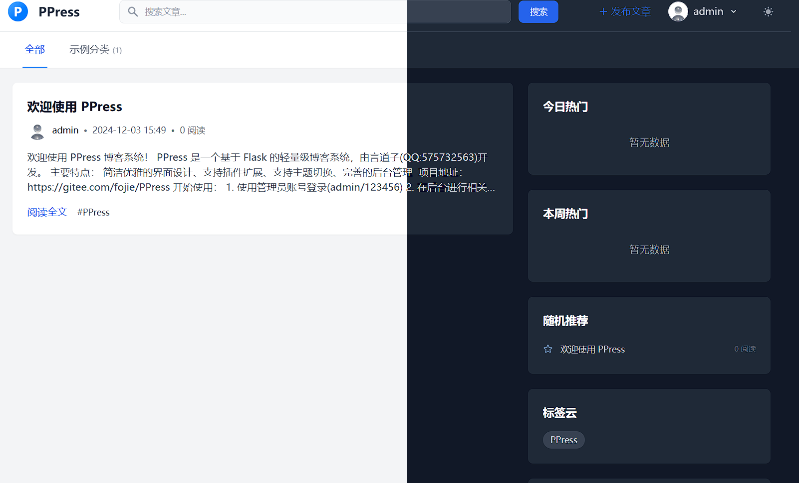

    

<h1 align="center" style="margin: 2px 0 30px; font-weight: bold;">
    PPress
</h1>

<h4 align="center">一个基于Python的CMS系统，采用Flask极致构建</h4>

## 简介
PPress 是一个基于 Flask 框架构建的功能丰富的CMS系统，采用 Flask 技术栈开发，具备内存缓存、缓存预热等优化机制，支持 sqlite 和 mysql 两种数据库。
提供文章发布、搜索、分类浏览等基本功能，融入文章情感分析、黑夜模式等特色功能，同时拥有完善的后台管理系统，涵盖用户管理、文章管理、评论管理、系统配置管理等多个方面，是一个适合任何Web的开源CMS平台。

## 功能
文章管理系统该有的功能都差不多有，支持插件、模版、自定义路由（相当于伪静态）、等等...

## 截图

## 运行
1. 下载代码，解压缩
2. 安装依赖 pip install -r requirements.txt
3. 在config/database文件MYSQL_CONFIG变量中配置数据库
4. 运行 init_db.py 文件 初始化数据库
5. 运行 run.py
6. 后台地址：`/admin/`

## 许可证

本项目采用 MIT 许可证,详情请参阅 [LICENSE](LICENSE) 文件。